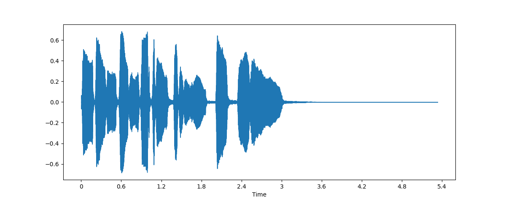
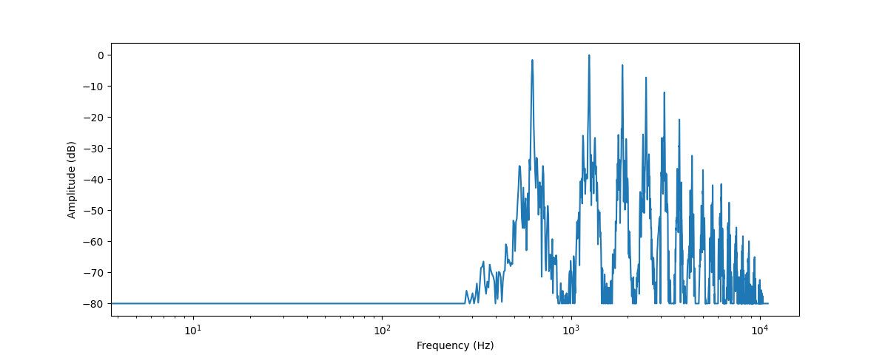
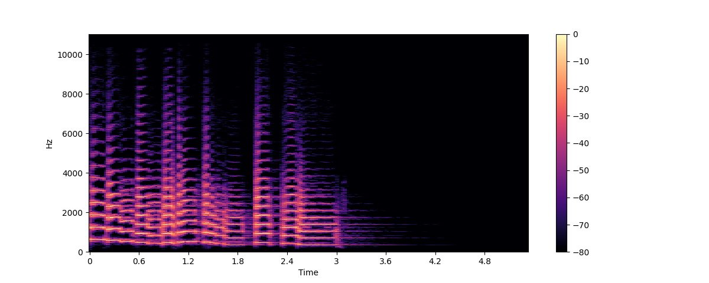
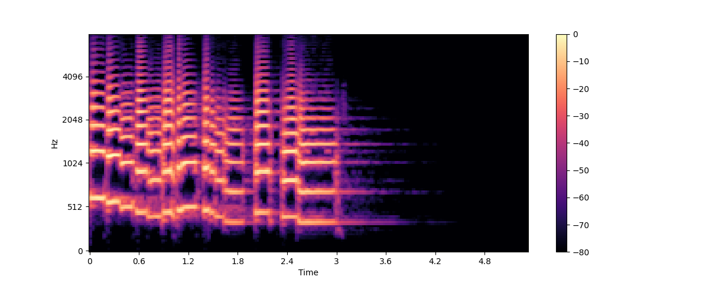

# Introduction to audio data

介紹涵蓋聲音的基本表示方式與分析方法，包括: `取樣率 (Sampling Rate)`、`位元深度 (Bit Depth)`、`波形 (Waveform)`、`頻譜 (Spectrum)`、`頻譜圖 (Spectrogram)`及`Mel 頻譜圖`等關鍵概念。

## 1. What is Digital Audio?

- 聲音是連續的類比訊號，需透過 **取樣（sampling）** 與 **量化（quantization）** 轉為離散數位訊號。
- 常見數位音訊格式：`.wav`, `.flac`, `.mp3`。

    | 格式          | 類型        | 特性                      |
    | ------------ | ---------- | ---------------           |
    | WAV (.wav)   | Linear PCM | 無壓縮，音質最高，體積大      |
    | FLAC (.flac) | Lossless   | 可還原，壓縮比 50–60%       |
    | MP3 (.mp3)   | Lossy      | 心理聲學壓縮，體積小，音質有損 |

- 儲存數位聲音的關鍵參數為：取樣率（sampling rate）與位元深度（bit depth）。

## 2. Sampling and Sampling Rate (取樣及取樣率)

- **Sampling**：以固定時間間隔取樣連續聲波，將其數位化。
- **Sampling Rate**：每秒取樣的次數，以 Hz 為單位。例如:
  - CD 音質: 為 44,100 Hz
  - 高解析音質: 192,000 Hz
  - 語音模型常用: 16,000 Hz

- `Nyquist Frequency`: 取樣率的一半。例如: 人耳的聽覺介乎20Hz到20kHz。CD音訊訊號的採樣頻率為44100Hz，那麼它的奈奎斯特頻率就是22050Hz，確保22kHz以下的音訊得以保存，滿足人耳的聽覺範圍

    > 當訊號頻率高於採樣率的一半時，會導致頻率混疊 (Aliasing) 和信息損失。

#### 取樣率選擇原則

- 取樣率需至少為最高訊號頻率的兩倍，以避免混疊（aliasing）。
- 人耳可感知的語音頻段多在 8 kHz 以下，16 kHz 已足夠。
- 較高取樣率可擴展可捕捉的頻帶，但也會增加計算與儲存成本。
- 過低取樣率則會喪失高頻資訊，導致音質低沉失真。

#### 一致性與重取樣（Resampling）

- 在訓練或微調 ASR 或語音模型時，所有音訊檔案須統一取樣率。
- 若資料集或預訓練模型的取樣率不一致，可在前處理階段進行重取樣。

## 3. Amplitude and Bit Depth

- **聲波振幅（Amplitude）**
  - 指聲波瞬間的氣壓大小，數位化後以分貝（dB）為單位表示，dB越大越表示響亮。
  - 人耳對幅值的感受稱為「響度」（Loudness），日常對話約 60 dB 以下，搖滾演出可達 125 dB（接近人耳極限）。

- **Bit Depth（量化精度）**
  - 決定每個取樣值的精度。
    - 16-bit: 可取值 2¹⁶＝65 536 個層級
    - 24-bit: 可取值 2²⁴＝16 777 216 個層級
    - 32-bit floating point:
      - 取樣值存成浮點數（範圍 –1.0 ～ +1.0），實質精度約相當於 24-bit。
      - 機器學習模型輸入通常使用 float32，因此最終都會將音訊轉成浮點格式。

- **動態範圍與 dBFS（Decibels Full Scale）**
  - 0 dBFS：數位音訊可表示的最大幅值
  - 負分貝（如 –6 dBFS）表示相對於最大值的衰減，–6 dBFS 即振幅減半；–60 dBFS 以下接近不可聽。

## 4. Audio as a Waveform

波形圖（Waveform）是聲音的時域表示。
以下使用 `librosa` 中自帶的 `trumpet` audio data 來當範例，如下:

```python
import librosa
import librosa.display
import matplotlib.pyplot as plt

array, sampling_rate = librosa.load(librosa.ex("trumpet"))

plt.figure().set_figwidth(12)
librosa.display.waveshow(array, sr=sampling_rate)
plt.show()
```



- 將數位音訊每個取樣點的振幅值對應至時間軸上的曲線圖。
- x 軸：時間（秒）；y 軸：振幅（對應 float 值或 PCM 整數值）。

## 5. The frequency spectrum

頻譜（Frequency Spectrum）也稱為信號的頻域表示。頻譜可以通過將信號做`離散傅立葉轉`換來得到。

- 離散傅立葉轉換（DFT）與快速傅立葉轉換（FFT）
  - DFT：將有限長度離散訊號映射到頻域的數學運算。
  - FFT：計算 DFT 的高效演算法，實務上常以「FFT」泛稱「DFT」。相關實作可參考: [kaka-lin/fft](https://github.com/kaka-lin/fft)

下面使用 numpy 的 `rfft()` 函數來進行 `DFT`。這邊不是繪製整個聲音的頻譜，而是使用一小段區域，
這邊使用前 4096 個取樣點（約第一個音符長度）作為 DFT 輸入，可聚焦單一時刻的頻譜特性。如下:

```python
import numpy as np
import librosa
import librosa.display
import matplotlib.pyplot as plt

dft_input = array[:4096]

# calculate the DFT
window = np.hanning(len(dft_input))
windowed_input = dft_input * window
dft = np.fft.rfft(windowed_input)

# get the amplitude spectrum in decibels
amplitude = np.abs(dft)
amplitude_db = librosa.amplitude_to_db(amplitude, ref=np.max)

# get the frequency bins
frequency = librosa.fft_frequencies(sr=sampling_rate, n_fft=len(dft_input))

plt.figure().set_figwidth(12)
plt.plot(frequency, amplitude_db)
plt.xlabel("Frequency (Hz)")
plt.ylabel("Amplitude (dB)")
plt.xscale("log")
plt.show()
```



我們繪製的頻譜圖顯示出幾個峰值。這些峰值對應於正在演奏的音符的諧波，其中諧波越高越安靜。由於第一個峰值位於 620 Hz 左右，因此這是 E♭ 音符的頻譜。

- `振幅譜（Magnitude Spectrum/Amplitude Spectrum）`
  - 幅值: 取複數頻譜的絕對值 ∣X∣。這邊是使用 `np.abs(dft)`。
  - dB 轉換: 使用 `librosa.amplitude_to_db()` 將振幅值轉換為分貝刻度，從而更容易看到頻譜中的更精細的細節。有時人們會使用`功率譜（Power Spectrum）`，它測量能量而不是振幅；這只是一個振幅值平方的頻譜。

- `功率譜（Power Spectrum）`
  - 若以能量度量，可將幅度平方： `|X|^2`
  - 功率頻譜與幅度頻譜皆屬同一訊息，僅量化方式不同。
  - db 轉換: 使用 `librosa.power_to_db()`

- `相位譜（Phase Spectrum）`
  - 由複數頻譜的相位角 ∠X 組成，表徵各頻率成分相對時間的位移。
  - 多數機器學習應用僅取幅度頻譜，捨棄相位資訊。

## 6. Spectrogram（頻譜圖）

> 以「時間–頻率–振幅」三維方式呈現音訊，橫軸為時間、縱軸為頻率，顏色深淺代表該時刻該頻率分量的強度（dB）。
>
> ##### Spectrum (頻譜) 與  Spectrogram（頻譜圖）的關係
> - 頻譜是二維的資訊，橫軸是頻率，縱軸是強度
> - 頻譜圖是三維的資訊，橫軸是時間，縱軸是頻率，強度用顏色表示

我們能否用某種方法表示出`頻率成分隨著時間的變化`呢？在這段小號音頻中，演奏者實際上吹奏了幾個不同頻率的音符。頻譜的問題在於其只能表示一個短暫時間內各個頻率成分的總體振幅。這裡的解決方法是我們可以進行多次的 DFT，每次 DFT 都涵蓋一小段不同的時間段，然後再把所有的頻譜堆疊起來，這樣就構成了`頻譜圖（spectrogram）`。

頻譜圖（spectrogram）表示了音頻訊號中各個頻率成分隨時間變化的過程。它可以讓你在一張圖中看到時間、頻率和振幅的所有資訊。計算頻譜圖的演算法被稱為：`短時傅立葉變換（Short Time Fourier Transform, STFT）`。

##### 頻譜圖的計算大概為以下幾個步驟:

1. 將音訊切成多個短片段（通常幾毫秒，Librosa 預設 2048 樣本長度）
2. 對每個片段執行 DFT
3. 將所有片段的頻譜沿時間軸堆疊起來

以下我們用 `librosa的stft()` 函數和 `specshow()` 函數來繪製 audio 的時頻譜圖，如下:

```python
import numpy as np
import librosa
import librosa.display
import matplotlib.pyplot as plt

D = librosa.stft(array)
S_db = librosa.amplitude_to_db(np.abs(D), ref=np.max)

plt.figure().set_figwidth(12)
librosa.display.specshow(S_db, x_axis="time", y_axis="hz")
plt.colorbar()
plt.show()
```



在該圖中，x軸表示的是和波形圖中相同的時間，但y軸現在表示不同的頻率，以 Hz 為單位。顏色的強度表示著當前時間點和頻率的振幅強度，使用分貝（dB）標度。

頻譜圖中的每個垂直切片都是一個單獨的頻譜。 `librosa.stft()` 函數在預設條件下會把音頻訊號分割成 `2048` 個樣本的許多切片，這一數字是在權衡了頻譜圖的頻域解析度和時域解析度之後設定的。

由於頻譜圖和波形是同一訊號的不同表示方法，我們也可以利用`反向短時傅立葉變換（inverse STFT`）將頻譜圖轉換回原始的波形。然而，這項操作需要頻譜圖的振幅跟相位資訊。目前的機器學習模型大多只能產生振幅譜。這時我們可以使用一些相位重建（phase reconstruction）方法，包括傳統的Griffin-Lim演算法，或者使用被稱為聲碼器（vocoder）的神經網路來從頻譜圖還原其波形。

頻譜圖圖的作用不僅在於音訊的可視化。許多機器學習模型也會使用頻譜圖作為模型的輸入和輸出而不直接使用音訊的波形。

## 7. Mel Spectrogram（梅爾頻譜圖）

> 頻譜圖的一種變形，橫軸為時間、縱軸為 Mel 頻率刻度，顏色深淺代表該時刻該頻率分量的能量（dB）。
>
> 梅爾頻譜圖之間也有各種差別！有兩種常用的 mel 尺度: `"htk"` 和 `"slaney"`，此外還有`”功率頻譜圖 (power spectrogram)“和“振幅譜圖 (amplitude spectrogram)”的區別。因此，在使用以梅爾譜作為輸入的機器學習模型時，我們建議你檢查梅爾譜的計算過程是否完全一致。
>
> 轉換成分貝表示後的梅爾頻譜圖稱為: `“對數梅爾頻譜圖（log-mel spectrum）”`。

梅爾頻譜 (Mel 頻譜) 是一種在語音處理和機器學習中常用的`頻譜圖 (Spectrogram) 變體`。梅爾頻譜也和頻譜圖一樣表示了頻率成分隨時間的變化，只是頻率所在的軸不同。

在標準的頻譜圖中，頻率所在的軸是 Hz 的線性變化軸。然而，人類的聽覺系統對於低頻率聲音的變化較敏感，對於高頻率聲音的變化則較不敏感。這敏感度的變化是隨頻率的上升呈對數關係下降的。 `mel scale` 作為一種感知刻度模擬了人耳對於頻率的非線性感知。

為了創建梅爾頻譜圖，我們首先使用和標準頻譜圖相同的短時傅立葉變換（STFT），將音訊分割為許多短時片段，並計算每個片段的頻譜。然後，我們將每個片段的頻譜輸入進梅爾濾波器組（mel filterbank）以將頻率轉換為梅爾刻度。

##### Mel 頻譜的計算大概為以下幾個步驟:

1. 將音訊切成多個短片段（通常幾毫秒，Librosa 預設 2048 樣本長度）
2. 對每個片段執行 DFT
3. 將每個頻譜透過一組預定義的三角形濾波器（Mel filterbank），把線性頻率映射到 Mel 上。
4. Mel 頻譜也用分貝來表示梅爾頻率成分的強度，稱為 `對數梅爾頻譜圖（Log-Mel spectrogram`
   1. 若使用`功率譜 (power spectrogram)`: `librosa.power_to_db()`
   2. 若用`振幅譜 (amplitude spectrogram)`: `amplitude_to_db()`
5. 將所有片段的頻譜沿時間軸堆疊起來

以下我們使用 librosa 的 `melspectrogram()` 來繪製梅爾頻譜圖，如下:

```python
import numpy as np
import librosa
import librosa.display
import matplotlib.pyplot as plt

S = librosa.feature.melspectrogram(y=array, sr=sampling_rate, n_mels=128, fmax=8000)
S_dB = librosa.power_to_db(S, ref=np.max)

plt.figure().set_figwidth(12)
librosa.display.specshow(S_dB, x_axis="time", y_axis="mel", sr=sampling_rate, fmax=8000)
plt.colorbar()
```



- `n_mels`: 代表梅爾濾波器組中的濾波器個數（例如 40、80），決定濾波器組的數量與解析度
- `fmax`: 最高關注頻率（Hz），通常設為取樣率的一半或人耳上限。

和標準頻譜圖 (regular spectrogram) 一樣，通常用`分貝`來表示梅爾頻率成分的強度。由於分貝的轉換過程涉及對數運算，轉換後的梅爾譜通常被稱為`對數梅爾頻譜圖（log-mel spectrum）`。在上面範例中，我們使用 `librosa.power_to_db()` 作為 `librosa.feature.melspectrogram()` 來建立 `功率頻譜 (power spectrogram)`。

`對數梅爾頻譜圖 (Log-Mel spectrogram)`，可以捕捉更多人類可感知的音訊特徵，因此對數梅爾頻譜圖也成為了在語音辨識、說話者辨識、音樂風格分類等任務中更常用的選擇。
