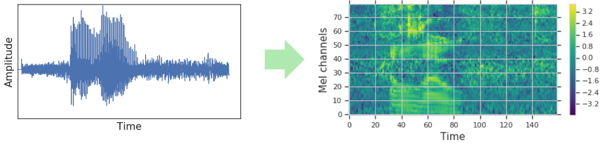

# Fine-tuning Whisper Model Step by Step

本指南以 `Common Voice` 資料集作為主要範例。若要使用您自己的資料集（例如 `KsponSpeech`），您需要進行以下調整：

1.  **準備資料集**：確保您的資料集符合 🤗 Datasets 的格式，通常包含 `audio` 和 `sentence` 兩個欄位。您可以參考 [kaka-lin/ksponspeech](https://github.com/kaka-lin/ksponspeech) 來了解如何前處理 `KsponSpeech` 資料集。

2.  **修改載入腳本**：在 `finetune.py` 或類似的腳本中，將 `load_dataset` 的參數替換成您自己的資料集路徑或 Hugging Face Hub 上的名稱。

## 1. Load Dataset

Common Voice 是一系列由群眾外包（crowd-sourced）建立的資料集，講者會在各種語言中朗讀維基百科上的文字。本文撰寫時，我們會使用 Common Voice 資料集的版本: 13.0。至於目標語言，我們將在華語（zh-TW）上，對模型做微調。

> 提示：你可以到 Hugging Face Hub 上的 Mozilla Foundation 組織頁面，查看 Common Voice 資料集的最新版本。後續版本支援更多語言，且每種語言的資料量也會增加。

接著，我們前往 Hub，開啟 Common Voice 的資料集頁面：[mozilla-foundation/common_voice_13_0](https://huggingface.co/datasets/mozilla-foundation/common_voice_13_0)。

首次開啟此頁面時，系統會要求你同意使用條款；同意後就能完整存取該資料集。
完成資料集使用授權之後，系統會顯示資料集預覽（preview），預覽中列出了前 100 筆範例，並且內建音檔播放器，可立即收聽。

使用 [🤗 Datasets](https://huggingface.co/docs/datasets/index) 下載並準備資料變得非常簡單。我們只需一行程式碼，就能下載並準備 Common Voice 的各個資料拆分。

```python
from datasets import load_dataset, DatasetDict

common_voice = DatasetDict()

common_voice["train"] = load_dataset("mozilla-foundation/common_voice_13_0", "zh-TW", split="train+validation")
common_voice["test"] = load_dataset("mozilla-foundation/common_voice_13_0", "zh-TW", split="test"),

common_voice = common_voice.select_columns(["audio", "sentence"])
```

## 2. Feature Extractor, Tokenizer and Processor

The ASR pipeline can be de-composed into three stages:

1. 一個特徵擷取器（feature extractor）: 負責預處理原始音訊輸入
2. 一個模型: 執行 sequence-to-sequence 的映射
3. 一個標記器（tokenizer）: 將模型輸出後處理成文字格式

在🤗 Transformers 中，Whisper 模型有一個相關的特徵提取器（feature extractor）和標記器（tokenizer），分別稱為 [WhisperFeatureExtractor] 和 [WhisperTokenizer]。

### WhisperFeatureExtractor

Whisper feature extractor（特徵提取器）會執行兩項操作:

1. 對一批音訊樣本進行 *padding(填充)* 或 *truncation(截斷)*，使每筆樣本的長度都為 30 秒。
    - 若樣本短於 30 秒: 則在序列末端補零（零代表靜音）
    - 若超過 30 秒: 則截掉超出部分。

    由於整個批次皆被調整至相同的最大長度，傳入 Whisper 模型時就不需要提供 *attention mask*。

    > Whisper 在這點上相當特殊──大多數音訊模型都必須用 attention mask 標示填充位置，以便在自注意力運算中忽略那些時刻，但 Whisper 已經訓練到不用 attention mask，就能自行判斷哪些部分該被忽略。

2. 特徵擷取器會將 padding 後的音訊陣列轉換為[對數梅爾頻譜圖（log-Mel spectrogram）](https://github.com/kaka-lin/ASR-notes/blob/main/basic/audio_data/introduction.md#7-mel-spectrogram%E6%A2%85%E7%88%BE%E9%A0%BB%E8%AD%9C%E5%9C%96)。

    這種頻譜圖類似傅立葉轉換，可視化地呈現訊號在不同頻率上的強度。縱軸代表梅爾頻道（對應特定頻率區間），橫軸代表時間，每個像素的顏色則顯示該頻率區間在該時刻的對數強度。對數梅爾頻譜圖正是 Whisper 模型所需的輸入形式。

梅爾頻道（頻率區間）是語音處理的標準設置，旨在模擬人耳的聽覺範圍。在 Whisper 微調時，我們只需了解頻譜圖是語音頻率的視覺化呈現。若想深入瞭解梅爾頻道的原理，可參考[「梅爾頻率倒譜」（Mel-frequency cepstrum）](https://en.wikipedia.org/wiki/Mel-frequency_cepstrum)相關文獻。

<p align="center">
  
  <br>
  <sub>圖片來源：<a href="https://research.google/blog/specaugment-a-new-data-augmentation-method-for-automatic-speech-recognition/">Google SpecAugment Blog</a></sub>
</p>

幸運的是，🤗 Transformers Whisper feature extractor 僅用一行程式碼就能完成填充和頻譜圖轉換！讓我們繼續從預先訓練好的檢查點載入特徵提取器，為我們的音訊資料做好準備：

```python
from transformers import WhisperFeatureExtractor

feature_extractor = WhisperFeatureExtractor.from_pretrained("openai/whisper-small")
```

### WhisperTokenizer

Whisper 模型輸出的 text token（文字標記）代表預測文字在詞彙字典中的索引。*tokenizer* 負責將一連串的 text token 映射為實際的文字串，例如：

    [1169, 3797, 3332] → the cat sat

傳統上，當使用僅編碼器（encoder-only）架構的 ASR 模型時，我們會採用 [Connectionist Temporal Classification (CTC)](https://distill.pub/2017/ctc/) 進行解碼，此時需要為每個資料集訓練對應的 CTC tokenizer。採用編碼器–解碼器（encoder-decoder）架構的一大優勢是，我們可以直接使用預訓練模型所附帶的 tokenizer。

Whisper 的 tokenizer 已在 96 種預訓練語言的轉錄資料上進行預訓練，因此具備豐富的 [byte-pair](https://huggingface.co/learn/llm-course/chapter6/5?fw=pt#bytepair-encoding-tokenization)，適用於幾乎所有的多語 ASR 應用。對於華語（zh-TW），我們可以直接載入該 tokenizer，並在微調時無需任何額外修改。我們只要指定目標語言和任務，tokenizer 就會在編碼後的 label sequences 開頭自動加上對應的語言與任務標記：

```python
from transformers import WhisperTokenizer

tokenizer = WhisperTokenizer.from_pretrained("openai/whisper-small", language="zh", task="transcribe")
```

驗證：

```python
input_str = common_voice["train"][0]["sentence"]
labels = tokenizer(input_str).input_ids
decoded_with_special = tokenizer.decode(labels, skip_special_tokens=False)
decoded_str = tokenizer.decode(labels, skip_special_tokens=True)

print(f"Input:                 {input_str}")
print(f"Decoded w/ special:    {decoded_with_special}")
print(f"Decoded w/out special: {decoded_str}")
print(f"Are equal:             {input_str == decoded_str}")
```

Print Output:

```bash
Input:                 地圖炮
Decoded w/ special:    <|startoftranscript|><|zh|><|transcribe|><|notimestamps|>地圖炮<|endoftext|>
Decoded w/out special: 地圖炮
Are equal:             True
```

### Combine To Create A WhisperProcessor

為了簡化特徵提取器和標記器的使用，我們可以將它們包裝到一個 [WhisperProcessor](https://huggingface.co/docs/transformers/model_doc/whisper#transformers.WhisperProcessor) 類別中。此處理器物件繼承自 `WhisperFeatureExtractor` 和 `WhisperTokenizer`，可根據需要用於音訊預處理和文字標記後處理。這樣，我們在訓練期間只需要追蹤兩個物件：`處理器 (processor)` 和 `模型 (model)`：

```python
from transformers import WhisperProcessor

processor = WhisperProcessor.from_pretrained("openai/whisper-small", language="zh", task="transcribe")
```

## 3. Pre-Process the Data

我們將音訊的取樣率與 Whisper 模型的取樣率（16kHz）相匹配。由於我們的輸入音訊取樣率為 48kHz，因此我們需要將其下取樣至 16kHz，然後再將其傳遞給 Whisper 特徵擷取器。

我們將使用資料集的 [cast_column](https://huggingface.co/docs/datasets/main/en/package_reference/main_classes#datasets.Dataset.cast_column) 方法將音訊輸入設定為正確的取樣率。此操作不會直接更改音頻，而是在首次加載音頻樣本時向資料集發出信號，使其動態地重新採樣音頻樣本：

```python
from datasets import Audio

common_voice = common_voice.cast_column("audio", Audio(sampling_rate=16000))
```

現在我們可以撰寫一個函式，將資料準備好供模型使用：

1. 呼叫 `batch["audio"]` 來載入並重採樣音訊資料。如前所述，🤗 Datasets 會在執行時自動完成必要的重採樣。

2. 使用特徵擷取器（feature extractor），從我們的一維 audio array 計算出 log-Mel 頻譜圖的輸入特徵。

3. 利用 tokenizer 將轉錄文字編碼成對應的 label ids。

```python
def prepare_dataset(batch):
    # load and resample audio data from 48 to 16kHz
    audio = batch["audio"]

    # compute log-Mel input features from input audio array
    batch["input_features"] = feature_extractor(audio["array"], sampling_rate=audio["sampling_rate"]).input_features[0]

    # encode target text to label ids
    batch["labels"] = tokenizer(batch["sentence"]).input_ids
    return batch
```

我們可以使用 🤗 Datasets 的 `.map` 方法將資料準備函數應用於所有訓練樣本：

```python
common_voice = common_voice.map(
    prepare_dataset, remove_columns=common_voice.column_names["train"], num_proc=1)
```

最後，我們會過濾掉所有音訊樣本長度超過 30 秒的訓練資料。否則，這些樣本會被 Whisper 特徵提取器截斷，從而影響訓練的穩定性。我們定義了一個函數，對少於 30 秒的樣本傳回 True，對超過 30 秒的樣本傳回 False：

```python
max_input_length = 30.0


def is_audio_in_length_range(length):
    return length < max_input_length
```

我們透過 🤗 Datasets 的 `.filter` 方法將過濾函數應用於訓練資料集的所有樣本：

```python
common_voice["train"] = common_voice["train"].filter(
    is_audio_in_length_range,
    input_columns=["input_length"],
)
```

> 注意：目前資料集使用 torchaudio 和 librosa 進行音訊載入和重採樣。如果您希望實作自訂資料載入/取樣，可以使用「path」欄位取得音訊檔案路徑，並忽略「audio」欄位。

## 4. Training and Evaluation

現在我們已經準備好資料，就可以進入訓練流程。[🤗 Trainer](https://huggingface.co/docs/transformers/main/main_classes/trainer) 會為我們完成大部分繁重的工作，我們只需要做以下幾件事：

- 定義 data collator：data collator 會將預處理後的資料整理並轉成 PyTorch 張量，以供模型使用。

- 評估指標：在評估階段，我們要使用 [word error rate (WER)](https://huggingface.co/spaces/evaluate-metric/wer) 作為衡量標準，需要定義一個 `compute_metrics` 函式來進行此計算。

- 載入預訓練 checkpoint：需要載入預訓練好的檢查點，並正確配置以供訓練使用。

- 定義訓練參數：這些參數將由 🤗 Trainer 在建立訓練排程時使用。

當我們完成模型微調後，將在測試資料上進行評估，以驗證模型是否已正確學習將華語（zh-TW）語音轉錄成文字。

### Define a Data Collator

對於 *sequence-to-sequence* 語音模型而言，data collator（資料整理器）相當獨特，因為它會分開處理`input_features` 和 `labels`：

- `input_features` 由特徵擷取器（feature extractor）負責。
- `labels` 則由 tokenizer 處理。

`input_features` 已經被填充（padded）或截斷至 30 秒，並轉換成固定維度的對數梅爾頻譜圖 (log-Mel spectrogram)，因此我們只需要將它們轉為批次（batched）的 PyTorch 張量。這可以透過特徵擷取器的 `.pad` 方法並設定 `return_tensors="pt"` 來完成。由於輸入維度已固定，此處不會再額外填充；僅將 `input_features` 轉為 PyTorch 張量即可。

另一方面，`labels` 並未事先填充。我們先使用 tokenizer 的 `.pad` 方法，將所有序列填充到該批次中的最大長度；接著，將填充標記替換成 `-100`，以確保這些位置在計算損失（loss）時被忽略。最後，我們會從標籤序列開頭去掉「轉錄起始」標記，因為在訓練時會稍後再將它加回來。

我們可以利用先前定義的 WhisperProcessor，同時執行特徵擷取器與 tokenizer 的相關操作：

```python
import torch

from dataclasses import dataclass
from typing import Any, Dict, List, Union


@dataclass
class DataCollatorSpeechSeq2SeqWithPadding:
    processor: Any

    def __call__(
        self, features: List[Dict[str, Union[List[int], torch.Tensor]]]
    ) -> Dict[str, torch.Tensor]:
        # split inputs and labels since they have to be of different lengths and need different padding methods
        # first treat the audio inputs by simply returning torch tensors
        input_features = [
            {"input_features": feature["input_features"][0]} for feature in features
        ]
        batch = self.processor.feature_extractor.pad(input_features, return_tensors="pt")

        # get the tokenized label sequences
        label_features = [{"input_ids": feature["labels"]} for feature in features]
        # pad the labels to max length
        labels_batch = self.processor.tokenizer.pad(label_features, return_tensors="pt")

        # replace padding with -100 to ignore loss correctly
        labels = labels_batch["input_ids"].masked_fill(
            labels_batch.attention_mask.ne(1), -100
        )

        # if bos token is appended in previous tokenization step,
        # cut bos token here as it's append later anyways
        # bos: beginning of transcript token
        if (labels[:, 0] == self.processor.tokenizer.bos_token_id).all().cpu().item():
            labels = labels[:, 1:]

        batch["labels"] = labels

        return batch
```
現在我們可以初始化剛剛定義的資料整理器：
```python
data_collator = DataCollatorSpeechSeq2SeqWithPadding(processor=processor)
```

### Evaluation Metrics

接下來，我們定義在評估集上所使用的評估指標。我們將使用 [Word Error Rate (WER)](https://huggingface.co/learn/audio-course/chapter5/evaluation) 指標，這是評估 ASR 系統的「實際」指標。

我們將從 🤗 Evaluate 載入 WER 指標：

```python
import evaluate

metric = evaluate.load("wer")
```

然後，我們只需定義一個函數，該函數接收模型預測並傳回 WER 指標。這個名為 `compute_metrics` 的函數首先將 `label_ids` 中的 `pad_token_id` 替換為 `-100`（撤銷了我們在資料整理器中應用的步驟，以便在損失函數中正確忽略填充的標記）。然後，它將預測值和標籤 ID 解碼為字串。最後，計算預測值和參考標籤之間的 WER。在這裡，我們可以選擇使用 *normalised (標準化)* 的轉錄和預測值（已刪除標點符號和大小寫）進行評估。我們建議您遵循此方法，以便從標準化轉錄值獲得的 WER 改進中受益。

```python
from transformers.models.whisper.english_normalizer import BasicTextNormalizer

normalizer = BasicTextNormalizer()


def compute_metrics(pred):
    pred_ids = pred.predictions
    label_ids = pred.label_ids

    # replace -100 with the pad_token_id
    label_ids[label_ids == -100] = processor.tokenizer.pad_token_id

    # we do not want to group tokens when computing the metrics
    pred_str = processor.batch_decode(pred_ids, skip_special_tokens=True)
    label_str = processor.batch_decode(label_ids, skip_special_tokens=True)

    # compute orthographic wer
    wer_ortho = 100 * metric.compute(predictions=pred_str, references=label_str)

    # compute normalised WER
    pred_str_norm = [normalizer(pred) for pred in pred_str]
    label_str_norm = [normalizer(label) for label in label_str]
    # filtering step to only evaluate the samples that correspond to non-zero references:
    pred_str_norm = [
        pred_str_norm[i] for i in range(len(pred_str_norm)) if len(label_str_norm[i]) > 0
    ]
    label_str_norm = [
        label_str_norm[i]
        for i in range(len(label_str_norm))
        if len(label_str_norm[i]) > 0
    ]

    wer = 100 * metric.compute(predictions=pred_str_norm, references=label_str_norm)

    return {"wer_ortho": wer_ortho, "wer": wer}
```

### Load a Pre-Trained Checkpoint

現在讓我們載入預先訓練好的 Whisper small checkpoint。同樣，透過使用 🤗 Transformers，這很容易做到！

```python
from transformers import WhisperForConditionalGeneration

model = WhisperForConditionalGeneration.from_pretrained("openai/whisper-small")
```

在訓練過程中我們將 `use_cache` 設為 `False`，因為我們使用了 [梯度檢查點（gradient checkpointing）](https://huggingface.co/docs/transformers/v4.18.0/en/performance#gradient-checkpointing)，兩者不相容。同時，我們會覆蓋兩個生成（generation）參數，以控制模型在推理過程中的行為：透過設定`語言(language)`和`任務(task)`參數，強制模型在生成時加上語言與任務標記；並在推論時重新啟用 cache，以加快生成速度：

```python
from functools import partial

# disable cache during training since it's incompatible with gradient checkpointing
model.config.use_cache = False

# set language and task for generation and re-enable cache
model.generate = partial(
    model.generate, language="zh", task="transcribe", use_cache=True
)
```

### Define the Training Configuration

在最後一步中，我們定義所有與訓練相關的參數。在這裡，我們將訓練步數設定為 500。與預先訓練的 Whisper 模型相比，這些步數足以使其字錯誤率 (WER) 顯著提升。有關訓練參數的更多詳細信息，請參閱 [Seq2SeqTrainingArguments 文件](https://huggingface.co/docs/transformers/main_classes/trainer#transformers.Seq2SeqTrainingArguments)。

以下說明其中部分參數：

- `output_dir`: 用來儲存模型權重的 local 目錄，同時也會成為 Hugging Face Hub 上的儲存庫名稱。
- `generation_max_length`: 在評估時，自回歸生成階段允許產生的最大 token 數。
- `save_steps`: 訓練過程中，每隔這麼多步就會儲存一次中間檢查點，並且 asynchronously(非同步) 上傳到 Hub。
- `eval_steps`: 訓練過程中，每隔這麼多步就會對中間檢查點執行一次評估。
- `report_to`: 指定要將訓練日誌回報到哪裡。支援的平台有 `"azure_ml"`, `"comet_ml"`,`"mlflow"`, `"neptune"`, `"tensorboard"` 和 `"wandb"`。可選擇你喜歡的，或維持預設的 ""tensorboard” 將日誌同步到 Hub。

```python
from transformers import Seq2SeqTrainingArguments

training_args = Seq2SeqTrainingArguments(
    output_dir="./whisper-small-zh",  # name on the HF Hub
    per_device_train_batch_size=16,
    gradient_accumulation_steps=1,  # increase by 2x for every 2x decrease in batch size
    learning_rate=1e-5,
    lr_scheduler_type="constant_with_warmup",
    warmup_steps=50,
    max_steps=500,  # increase to 4000 if you have your own GPU or a Colab paid plan
    gradient_checkpointing=True,
    fp16=True,
    fp16_full_eval=True,
    evaluation_strategy="steps",
    per_device_eval_batch_size=16,
    predict_with_generate=True,
    generation_max_length=225,
    save_steps=500,
    eval_steps=500,
    logging_steps=25,
    report_to=["tensorboard"],
    load_best_model_at_end=True,
    metric_for_best_model="wer",
    greater_is_better=False,
    push_to_hub=True,
)
```
> If you do not want to upload the model checkpoints to the Hub, set `push_to_hub=False`.

We can forward the training arguments to the 🤗 Trainer along with our model, dataset, data collator and `compute_metrics` function:

```python
from transformers import Seq2SeqTrainer

trainer = Seq2SeqTrainer(
    args=training_args,
    model=model,
    train_dataset=common_voice["train"],
    eval_dataset=common_voice["test"],
    data_collator=data_collator,
    compute_metrics=compute_metrics,
    tokenizer=processor,
)
```

### Traning

To launch training, simply execute:

```python
trainer.train()
```

## Reference

- [Hugging Face/Audio Course/Fine-tuning](https://huggingface.co/learn/audio-course/chapter5/fine-tuning)
- [Fine-Tune Whisper For Multilingual ASR with 🤗 Transformers ](https://huggingface.co/blog/fine-tune-whisper#training-and-evaluation)
