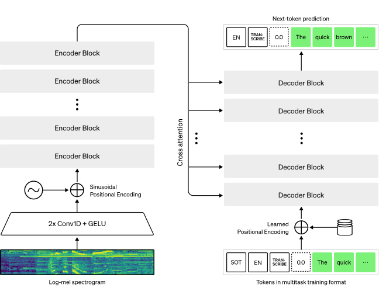

# Whisper 簡介

Whisper 是一個基於 Transformer 的 *encoder-decoder* 模型，也稱為 *sequence-to-sequence* 模型。它將一連串的音訊頻譜圖特徵映射成一連串的文字標記。首先，原始音訊輸入會經過`特徵擷取器（feature extractor`）轉換成`對數梅爾（log-Mel）頻譜圖`。接著，Transformer encoder 對這些頻譜圖進行編碼，生成一系列的編碼器隱藏狀態（encoder hidden states）。最後，decoder 以自回歸（autoregressive）方式，根據先前已預測的文字標記與編碼器隱藏狀態，逐步產生新的文字標記。下圖對 Whisper 模型的整體流程做了摘要說明。

  
   
  圖片來源：<a href="https://openai.com/index/whisper/">OpenAI Whisper Blog</a>

Whisper 的預訓練 (pre-trained) 與 [微調 (fine-tuned)](https://github.com/kaka-lin/ASR-notes/tree/main/whisper/finetune) 皆採用 *cross-entropy* 目標函數，這是訓練 *sequence-to-sequence* 系統進行分類任務時的標準做法。此處，系統被訓練去正確地從預先定義的文字詞彙表中，分類（預測）出目標文字標記。

## Awesome Whisper

### 1. Official Whisper

- OpenAI 官方介紹: [Whisper on OpenAI](https://openai.com/index/whisper)
- GitHub: [openai/whisper](https://github.com/openai/whisper)
- Paper: [Robust Speech Recognition via Large-Scale Weak Supervision](https://cdn.openai.com/papers/whisper.pdf)

### 2. Whisper Model Variants

Whisper-based implementations that improve speed, compatibility, or functionality.

| 名稱 | 特性 |
| --- | ---- |
| [faster-whisper](https://github.com/SYSTRAN/faster-whisper)                 | 使用 CTranslate2 加速推理（支援 CPU/GPU |
| [mlx-whisper](https://github.com/ml-explore/mlx-examples/tree/main/whisper) | Apple Silicon 上的 Whisper 實作 |
| [WhisperX](https://github.com/m-bain/whisperX)                              | 支援 Word-level timestamps 與 speaker diarization |

👉 延伸閱讀： [faster-whisper: cpu_threads 與 num_workers 說明](./faster_whisper_thread.md)

### 3. Whisper Streaming Implementations

Experimental or community-based projects that adapt Whisper for real-time/streaming ASR.

| 名稱 | 說明 |
| --- | ---- |
| [ufal/whisper_streaming](https://github.com/ufal/whisper_streaming)                 | Real-time Whisper with buffering and chunked inference |
| [WhisperLiveKit](https://github.com/QuentinFuxa/WhisperLiveKit)                      | Local real-time STT with speaker diarization, FastAPI server & web UI |
| [whisper-streaming-practice](https://github.com/kaka-lin/whisper-streaming-practice) | Practical implementation of streaming Whisper inference with custom audio/VAD handling |
